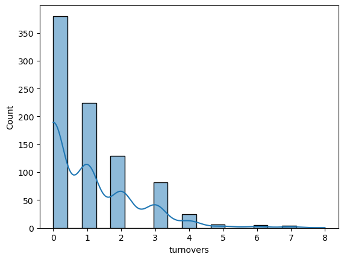
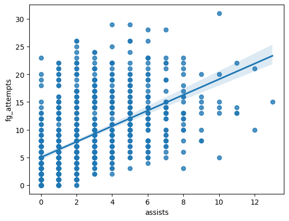
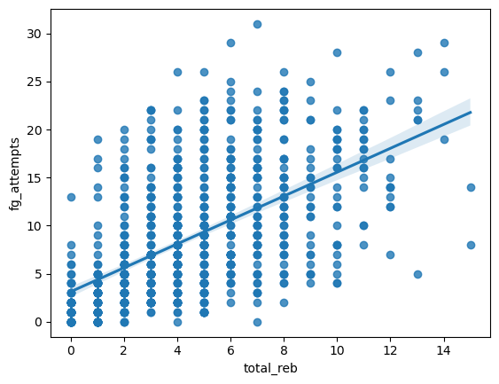

# TKH Capstone
The Boston Celtics won their most recent NBA Championship on June 17, 2024 after a historically dominant regular season in which they finished 14 games above the 2nd seed in the Eastern Conference.

To explore the factors that contributed to their success, I completed the following an exploratory analysis of the rosters' basic gamelog statistics, including  3-Point Field Goal %, Total Rebounds, and +/-. 

## Data Source
All of the data used in this project comes from [Basketball Reference](https://www.basketball-reference.com/), an open source website and "invaluable resource for writers, number-crunchers and fans" (Robert Bradley, president of the Association for Professional Basketball Research and author of The Compendium of Professional Basketball).

## Methodology
1. Web scraped relevant data from https://www.basketball-reference.com/ (navigated to 2023-2024 Boston Celtics roster, then collected each player's gamelog URL into a list).
2. Gathered data into one df and exported as a .csv file.
3. Completed data quality analysis (checked for missing values, reformatted incorrect datatypes, removed duplicate column titles repeated throughout the df). 
4. Perfoemed exploratory data analysis.

## Data Quality Analysis

* Since the first three columns of the dataframe ('Unnamed: 0', 'Rk', 'G') were all indexes of sorts, I opted to drop them. I also dropped 'GS' because with it did not inform my analysis, it simply stated whether the player started the game or not.

* Column titles repeated throughout the df. The columns affected included: Date, Age, Tm, Opp, GS, MP, FG, FGA, FG%, 3P, 3PA, 3P%, FT, FTA, FT%, ORB, DRB, TRB, AST, STL, BLK, TOV, PF, PTS, GmSc, and +/-. I dropped these values as they were redundant.

* The columns all shared the object datatype regardless of the information captured. I addressed this by reassigning datatypes as needed to include datetime, int, float, string, etc.

## Exploratory Trends

Turnover distribution positively skewed

The mode of this distriubtion reveals that a high volume of turnovers was uncommon.

On the offensive end, the more likely a player was to attempt a field goal, the more likely they were to assist another player in scoring. This trend would suggest efficient scoring output in which the ball movement was spread across the team leading to more shots.

On both the offesnive and defensive end, the more likely a player was to grab a rebound, the more likely they were to attempt a field goal. This indicates a trend in which players were effective on both ends of the floor, a highly sought after ability in the NBA. This is often referred to as being a 2-way player.